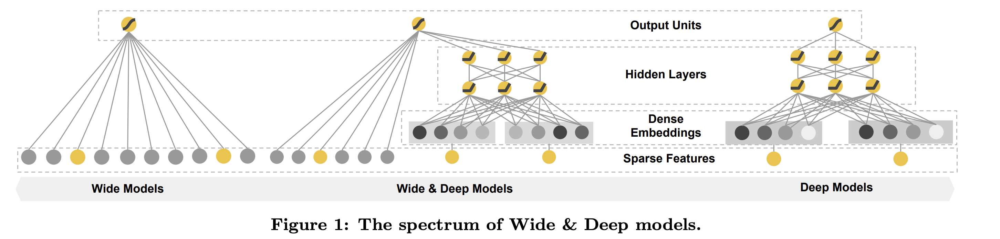

### Keyword
`Wide&Deep Learning` `Recommender Systems`

# ABSTRACT

Generalized linear models with nonlinear feature transformations are widely used for large-scale regression and classification problems with sparse inputs.  
비선형 변환을 함께 사용하는 일반화된 선형 모델들은 희소 데이터를 사용한 대규모의 회귀 문제나 분류 문제를 풀 때 사용된다.  

Memorization of feature interactions through a wide set of cross-product feature transformations are effective and interpretable, while generalization requires more feature engineering effort.  
[Wide: linear] 피처간의 cross-product를 사용해 아이템들의 특징을 기억하는 것은 효과적이고 해석이 가능하다는 장점이 있지만, 일반화하는데 있어서 많은 피처 엔지니어링 노력을 필요로 하였다.  

With less feature engineering, deep neural networks can generalize better to unseen feature combinations through low-dimensional dense embeddings learned for the sparse features.  
[Deep: nonlinear] 신경망 구조는 적은 피처 엔지니어링으로 학습하지 않은 피처 조합을 저차원의 임베딩을 통해 더욱 잘 일반화할 수 있었다.  

However, deep neural networks with embeddings can over-generalize and recommend less relevant items when the user-item interactions are sparse and high-rank.  
하지만, 임베딩을 사용한 신경망은 유저-아이템 상호작용이 sparse하거나 고차원일 때, 지나친 일반화를 하게 되고 유저와 낮은 관련성을 보이는 아이템을 추천하게 된다.  

In this paper, we present Wide & Deep learning—jointly trained wide linear models and deep neural networks—to combine the benefits of memorization and generalization for recommender systems.  
본 논문에서는 Wide & Deep 모델을 보이며, Wide에서는 선형 모델을, Deep에서는 신경망 구조를 사용하고 또 결합하여 기억과 일반화 측면의 두 가지 장점을 결합하고자 한다.  

We productionized and evaluated the system on Google Play, a commercial mobile app store with over one billion active users and over one million apps.  
우리는 Google Play (구글 플레이스토어)에 우리의 모델을 배포하였다.  

Online experiment results show that Wide & Deep significantly increased app acquisitions compared with wide-only and deep-only models.  
온라인 실험에서의 결과는 Wide & Deep이 단일 Wide 모델 또는 단일 Deep 모델을 사용했던 것에 비해 비약적인 어플리케이션 설치율의 향상을 보여주었다.  

We have also open-sourced our implementation in TensorFlow.  
우리는 또한 Tensorflow로 구현한 모델을 오픈소스화 하였다.  

 

# 1. INTRODUCTION

A recommender system can be viewed as a search ranking system, where the input query is a set of user and contextual information, and the output is a ranked list of items.  
추천시스템은 랭킹 시스템을 찾는 하나의 방법이라고 보여질 수 있다.   여기서 입력은 유저의 정보와 contextual 정보이며 출력은 상위에 랭크된 아이템들로 간주한다.  

Given a query, the recommendation task is to find the relevant items in a database and then rank the items based on certain objectives, such as clicks or purchases.  
주어진 쿼리에서 추천시스템의 작업은 데이터베이스에서 관련된 아이템들을 찾고, 특정 목적(클릭율, 구매율)에 맞게 아이템들에 순위를 매겨주는 것이다.  

One challenge in recommender systems, similar to the general search ranking problem, is to achieve both memorization and generalization.  
일반적인 검색 문제와 유사하게, 추천시스템이 직면한 문제는 기억(memorization)과 일반화(generalization) 성능을 동시에 높이는 것이다.  

Memorization can be loosely defined as learning the frequent co-occurrence of items or features and exploiting the correlation available in the historical data.  
기억(Memorization)에 대해 간략하게 소개하자면, 함께 자주 등장하는 아이템이나 피처를 학습하고 과거 데이터 (기록)속에 존재하는 상관관계를 사용하는 것을 말한다.

Generalization, on the other hand, is based on transitivity of correlation and explores new feature combinations that have never or rarely occurred in the past.  
반면에, 일반화(Generalization)은 상관관계를 파악하여 이전에 등장하지 않았던 새로운 조합이나 잘 등장하지 않은 새로운 특징 조합에 대해서도 추천을 해준다.  

Recommendations based on memorization are usually more topical and directly relevant to the items on which users have already performed actions.  
기억을 기반으로한 추천은 일반적으로 사용자가 이전에 상호작용했던 아이템들에 직접적으로 의존하여 이루어진다.  

Compared with memorization, generalization tends to improve the diversity of the recommended items.   
기억과 반대로, 일반화는 추천된 아이템의 다양성을 높이려는 경향이 존재한다.  

In this paper, we focus on the apps recommendation problem for the Google Play store, but the approach should apply to generic recommender systems.  
본 논문에서는, Google Play 스토어에 존재하는 애플리케이션 추천 문제를 다루지만 실제로는 더 다양한 추천 문제에서 적용가능한 새로운 모델을 제시한다.  

For massive-scale online recommendation and ranking systems in an industrial setting, generalized linear models such as logistic regression are widely used because they are simple, scalable and interpretable.  
현재 산업에서 대규모의 실시간 추천이나 랭킹 시스템에서는 널리 사용되는 선형 모델들 (로지스틱 회귀)이 사용된다.   그 이유는 해당 모델이 정말 단순하고, 확장성도 용이하며 추천된 결과를 해석할 수 있기 때문이다.  

The models are often trained on binarized sparse features with one-hot encoding.  
이 모델들은 주로 원-핫 인코딩을 거친 이진화된 희소한 피처들을 입력으로 하여 학습이 진행된다.  

E.g., the binary feature “user_installed_app=netflix” has value 1 if the user installed Netflix.  
예를 들어, 유저가 넷플릭스 앱을 설치하였다면, "설치한 앱=넷플릭스" 피처는 1이 되는 것이다 (원-핫 인코딩으로 표현하기 위해 각 열은 모든 앱의 목록의 크기만큼 존재해야 한다.  )

Memorization can be achieved effectively using cross-product transformations over sparse features, such as `AND(user_installed_app=netflix, impression_app=pandora”)`, whose value is 1 if the user installed Netflix and then is later shown Pandora.  
'기억'은 희소한 피처들간의 cross-product를 사용하여 효과적으로 계산하는 것이 가능하다. 예를 들어, "설치한 앱=넷플릭스, 노출한 앱=판도라" 라는 새로운 조합을 기존의 피처들로 생성할 수 있다.  

This explains how the co-occurrence of a feature pair correlates with the target label.  
따라서 피처 조합의 동시 발생이 정답 라벨과 어떤 상관관계를 갖는지 설명해줄 수 있다.  

Generalization can be added by using features that are less granular, such as `AND(user_installed_category=video, impression_category=music)`, but manual feature engineering is often required.  
일반화는 "설치한 카테고리=비디오, 노출된 카테고리=음악"과 같이 덜 세분화된 피처를 추가할 수 있지만, 피처 엔지니어링 과정이 주로 요구된다.  

One limitation of cross-product transformations is that they do not generalize to query-item feature pairs that have not appeared in the training data.  
Cross-product transformation의 한계는 학습 데이터속에 존재하지 않는 쿼리-아이템 쌍의 피처조합을 만들어낼 수 없다는 것이다.  

Embedding-based models, such as factorization machines or deep neural networks, can generalize to previously unseen query-item feature pairs by learning a low-dimensional dense embedding vector for each query and item feature, with less burden of feature engineering.  
Factorization Machine이나 DNN과 같은 임베딩 기반 모델들은 각각의 쿼리와 아이템에 대한 저차원의 dense한 임베딩 벡터를 학습하여 이전에 보지 못했던 쿼리-아이템 피처 쌍을 일반화할 수 있다.

However, it is difficult to learn effective low-dimensional representations for queries and items when the underlying query-item matrix is sparse and high-rank, such as users with specific preferences or niche items with a narrow appeal.  
하지만, 쿼리-아이템 행렬이 희소하고 고차원일 때, 쿼리와 아이템들에 대한 저차원의 표현(임베딩 벡터)를 학습한다는 것은 어려운 일이다.

In such cases, there should be no interactions between most query-item pairs, but dense embeddings will lead to nonzero predictions for all query-item pairs, and thus can over-generalize and make less relevant recommendations.  
이런 경우, 대부분의 쿼리-아이템 쌍에서 상호작용이 없으며, dense한 임베딩은 모든 쿼리-아이템 쌍에 대해 0이 아닌 예측을 만들어낼 것이다. 결국 과도하게 일반화되거나 관련이 적은 아이템들이 추천될 것이다.

On the other hand, linear models with cross-product feature transformations can memorize these “exception rules” with much fewer parameters.  
반면, cross-product feature transformation을 사용하는 선형 모델들은 훨씬 적은 파라미터를 사용하여 이러한 "예외 규칙"을 기억하는 것이 가능하다.

In this paper, we present the Wide & Deep learning framework to achieve both memorization and generalization in one model, by jointly training a linear model component and a neural network component as shown in Figure 1.  
본 논문에서 우리는 Wide & Deep 학습 프레임 워크를 선보이며 선형모델과 신경망 모델을 함께 학습하여 기억과 일반화 모두 하나의 모델에서 좋은 성능을 보임을 보여줄 것이다.

 

# 2. RECOMMENDER SYSTEM OVERVIEW

An overview of the app recommender system is shown in Figure 2.  
애플리케이션 추천 시스템의 전반적인 구조는 Figure 2에 나타나있다.  

A query, which can include various user and contextual features, is generated when a user visits the app store.  
"쿼리"는 다양한 유저와 문맥적 피처들을 포함할 수 있는 것으로, 유저가 앱스토어에 방문하게 되면 생성된다.  

The recommender system returns a list of apps (also referred to as impressions) on which users can perform certain actions such as clicks or purchases.  
추천시스템은 앱들의 목록(=impression)을 반환하게 되며, 이 목록은 유저의 클릭 또는 구매로 이어질 수 있게 된다.  

These user actions, along with the queries and impressions, are recorded in the logs as the training data for the learner.  
이러한 유저의 행동은 쿼리와 추천된 앱들의 목록과 함께 로그로 기록되어 학습 데이터로 사용되게 된다.  

Since there are over a million apps in the database, it is intractable to exhaustively score every app for every query within the serving latency requirements (often O(10) milliseconds).  
데이터베이스에는 수백만개의 앱이 존재하기 때문에, 주어진 조건인 아주 짧은 시간동안 모든 쿼리에 대한 모든 정확한 점수를 추적하기는 어렵다.  

Therefore, the first step upon receiving a query is retrieval.  
따라서, 첫 번째 단계에서 받는 쿼리는 추출이다.  
 
The retrieval system returns a short list of items that best match the query using various signals, usually a combination of machine-learned models and human-defined rules.  
추출 시스템은 기계가 만들어낸 규칙과 사람이 정의한 규칙과 같은 다양한 신호를 포함한 쿼리와 잘 맞는 짧은 길이의 아이템 리스트를 반환한다.  

After reducing the candidate pool, the ranking system ranks all items by their scores.  
이렇게 되면 수백만개의 아이템에서 후보군을 추릴 수 있고, 랭킹시스템은 모든 아이템들에 대해 얼마나 유저와 일치하는지 점수를 매기게 된다.  

The scores are usually $P(y\vert \mathbf{x})$, the probability of a user action label $y$ given the features $\mathbf{x}$, including user features (e.g., country, language, demographics), contextual features (e.g., device, hour of the day, day of the week), and impression features (e.g., app age, historical statistics of an app).  
점수는 일반적으로 $P(y \vert \mathbf{x})$ 이며 이는 주어진 특징 $\mathbf{x}$ 가 있을 때, 유저의 행동 $y$가 일어날 확률을 의미한다.  

In this paper, we focus on the ranking model using the Wide & Deep learning framework.  
본 논문에서 우리는 Wide & Deep 학습 프레임워크를 통한 랭킹 모델의 생성에 집중한다.  

 

# 3. WIDE & DEEP LEARNING

## 3.1 The Wide Component

The wide component is a generalized linear model of the form $y = \mathbf{w}^{\top} \mathbf{x} + b$, as illustrated in Figure 1 (left).  
Wide 컴포넌트는 일반화된 선형 모델로서 $y = \mathbf{w}^{\top} \mathbf{x} + b$ 와 같이 나타내지며, Figure 1의 왼쪽 그림과 같다.

$y$ is the prediction, $\mathbf{x} = [x_1, x_2, ..., x_d]$ is a vector of $d$ features, $\mathbf{w} = [w_1, w_2, ..., w_d]$ are the model parameters and $b$ is the bias.  
$y$ 는 예측값을 말하며, $\mathbf{x} = [x_1, x_2, ..., x_d]$ 는 $d$ 개의 피처를 갖는 벡터를 말하고, $\mathbf{w} = [w_1, w_2, ..., w_d]$ 는 모델의 파라미터, $b$ 는 bias 값을 말한다.

The feature set includes raw input features and transformed features.  
피처 집합은 원본 입력 자체와 만들어지거나 변형된 피처 모두 포함한다.

One of the most important transformations is the *cross-product transformation*, which is defined as:  
중요한 변형 중 하나는 cross-product transformation으로, 다음과 같이 정의된다.

$$ \tag{1} \phi_k (\mathbf{x}) = \prod_{i=1}^{d} x_{i}^{c_{ki}} \quad c_{ki} \in \{0, 1\}$$

where $c_{ki}$ is a boolean variable that is 1 if the $i$-th feature is part of the $k$-th transformation $\phi_k$, and 0 otherwise.  
여기서 $c_{ki}$ 값은 boolean 변수로서, $i$ 번째 피처가 $k$ 번째 변형인 $\phi_k$ 에 포함된다면 1이고 그렇지 않다면 0이다.

For binary features, a cross-product transformation (e.g., “AND(gender=female, language=en)”) is 1 if and only if the constituent features (“gender=female” and “language=en”) are all 1, and 0 otherwise.
`gender`, `language`과 같이 2개의 값만을 갖는 binary 피처에 대해 cross-product 변환은 구성하는 모든 값이 1이거나 0일 때만 결과가 1이고 그렇지 않다면 0이다. (AND 연산자)

This captures the interactions between the binary features, and adds nonlinearity to the generalized linear model.  
이렇게 함으로써 바이너리 피처간의 상호작용을 포착할 수 있고, 일반화된 선형모델에 비선형성을 추가할 수 있다.

# 3.2 The Deep Component
The deep component is a feed-forward neural network, as shown in Figure 1 (right).  
Deep 컴포넌트는 Figure1의 오른쪽에 보이는 것과 같이 Feed-forward 신경망이다.

For categorical features, the original inputs are feature strings (e.g., “language=en”).  
카테고리 피처들의 원본 입력은 문자열로 주어진다.

Each of these sparse, high-dimensional categorical features are first converted into a low-dimensional and dense real-valued vector, often referred to as an embedding vector.  
이러한 희소성 때문에, 고차원의 카테고리 피처는 먼저 저차원의 dense한 벡터인 임베딩 벡터로 변환된다.

The dimensionality of the embeddings are usually on the order of O(10) to O(100).  
임베딩의 차원은 일반적으로 10~100으로 설정한다.

The embedding vectors are initialized randomly and then the values are trained to minimize the final loss function during model training.  
임베딩 벡터들은 맨 처음에 랜덤하게 초기화되며, 최종 손실함수를 줄이는 방향으로 값 들이 조정되어진다.

These low-dimensional dense embedding vectors are then fed into the hidden layers of a neural network in the forward pass.  
이런 저차원 임베딩 벡터들은 은닉층으로 전달되어 신경망의 순전파가 이루어진다.

Specifically, each hidden layer performs the following computation:  
특히, 각 은닉층은 다음 연산을 수행한다:

$$\tag{2} a^{(l+1)} = f(W^{(l)}a^{(l)} + b^{(l)})$$

- $l$ : 레이어의 번호
- $f$ : 활성함수 (ReLU)
- $a^{(l)}$ : 입력/출력 값
- $b^{(l)}$ : bias 
- $W^{(l)} : 모델의 가중치

## 3.3 Joint Training of Wide & Deep Model

The wide component and deep component are combined using a weighted sum of their output log odds as the prediction, which is then fed to one common logistic loss function for joint training.
Wide 컴포넌트와 Deep 컴포넌트는 각각의 출력에 대한 가중합을 통해 결합되며, 이후 하나의 로지스틱 손실함수에 전달되어 두 컴포넌트 모두 학습되어진다.

Note that there is a distinction between joint training and ensemble.
하나 주의할 것은 결합학습과 앙상블에는 차이가 있다는 점이다.

In an ensemble, individual models are trained separately without knowing each other, and their predictions are combined only at inference time but not at training time.  
앙상블에서는 각 모델들은 서로의 존재를 모른채 분리되어 학습되며, 각각의 예측은 추론 단계에서만 결합되고, 학습단계에서는 결합되지 않는다.

In contrast, joint training optimizes all parameters simultaneously by taking both the wide and deep part as well as the weights of their sum into account at training time.  
반면, 결합학습은 wide와 deep부분을 동시에 가져가면서 모든 파라미터를 동시에 최적화한다.

There are implications on model size too:  
여기에는 모델의 크기도 영향을 줄 수 있다.

For an ensemble, since the training is disjoint, each individual model size usually needs to be larger (e.g., with more features and transformations) to achieve reasonable accuracy for an ensemble to work.  
앙상블에서는 학습이 상호배타적이기 때문에 각 모델의 크기는 더 높은 정확도를 갖기 위해 커지는 것이 좋다.

In comparison, for joint training the wide part only needs to complement the weaknesses of the deep part with a small number of cross-product feature transformations, rather than a full-size wide model.  
반면, 결합학습에서 wide 부분은 deep 부분의 단점을 모델의 크기를 키우기 보다는 적은 수의 cross-product 피처 변환을 통해 보완해줘야 한다.

Joint training of a Wide & Deep Model is done by backpropagating the gradients from the output to both the wide and deep part of the model simultaneously using mini-batch stochastic optimization.  
Wide & Deep 모델의 결합학습은 wide 파트와 deep 파트의 출력에 대한 그래디언트를 역전파하며 결합 학습이 이루어지며, 동시에 미니배치를 사용한 확률적 최적화를 진행한다.

In the experiments, we used Followthe-regularized-leader (FTRL) algorithm [3] with L1 regularization as the optimizer for the wide part of the model, and AdaGrad [1] for the deep part.  
실험에서 우리는 FTRL 알고리즘과 L1 규제를 모델의 wide 파트를 학습하는데 사용하였고, Deep 파트에서는 AdaGrad를 통해 모델을 최적화 시켰다.

The combined model is illustrated in Figure 1 (center).
결합한 모델은 Figure1에서 중앙에 위치한 사진이다.  

For a logistic regression problem, the model’s prediction is:
로지스틱 회귀 문제에서 모델의 예측은 다음과 같다:

$$P(Y=1\vert\mathbf{x}) = \sigma(\mathbf{w}^\top_{wide}[\mathbf{x}, \phi(\mathbf{x})] + \mathbf{w}^\top_{deep}a^{(l_f)} + b)$$

- $Y$ : 바이너리 클래스의 라벨
- $\sigma(\cdot)$ : 시그모이드 함수
- $\phi(\mathbf{x})$ : 원본 피처 $\mathbf{x}$ 에 대한 cross product transformation
- $b$ : bias
- $\mathbf{w}_{wide}$ : wide 모델에 대한 가중치 벡터
- $\mathbf{w}_{deep}$ : Deep 컴포넌트의 최종 출력 $a^{(l_f)}$ 에 사용될 가중치

